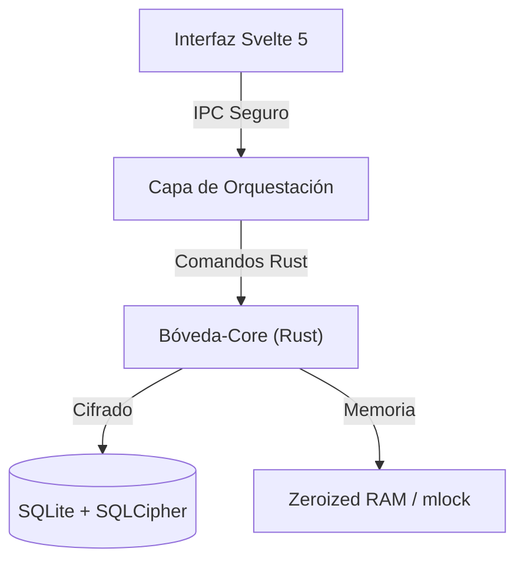

# Bóveda — Gestor de credenciales 🔒

Bóveda es **Seguridad por Aislamiento**. Priorizamos la seguridad aislada de la red y practicamos la transparencia digital.


---

## Resumen de Arquitectura

1.  **Aislamiento de Procesos:** Interfaz y motor desacoplados, con auditorias regulares.
2.  **Soberanía Digital:** No hay "nube por defecto". Tus datos te pertenecen, residen exclusivamente en tu sistema y eres el único responsable de ellos.
3.  **Resistencia Forense:** Se implementaron medidas para que, incluso si un atacante obtiene acceso físico a la memoria RAM o a los volcados de sistema, no encuentre rastros legibles de tu información.

---

## Bóveda-Core

El motor `boveda-core` es el responsable de proteger los datos sensibles:

### 🔐 Criptografía
-   **Almacenamiento:** Base de datos **SQLite + SQLCipher** con cifrado **AES-256-CBC**. Protegemos no solo las entradas, sino el esquema, los índices y los metadatos.
-   **Secretos:** Cada entrada individual se cifra adicionalmente con **ChaCha20-Poly1305**, proporcionando Cifrado Autenticado con Datos Asociados (AEAD).
-   **Protección contra Fuerza Bruta:** Implementamos **Argon2id** (Parámetros: 64MB RAM, 3 iteraciones, 4 hilos), el estándar de Password Hashing Competition, configurado para ser costoso en hardware especializado (ASIC/GPU).

### Gestión de Memoria
-   **Zeroización:** Se sobrescribe físicamente la memoria RAM con ceros en cuanto un secreto deja de ser necesario, mitigando ataques de reutilización de memoria.
-   **RAM Inamovible:** Implementamos `mlock` / `VirtualLock` para evitar que las claves maestras terminen en el archivo de intercambio (swap) del disco duro.
-   **Hardening del Proceso:** Desactivamos los `core dumps` y protegemos contra la inspección de procesos mediante políticas de seguridad a nivel de sistema operativo.

---

## Arquitectura de Capas



-   **`crates/boveda-core`**: El núcleo de Bóveda.
-   **`src-tauri`**: Gestiona los permisos y la comunicación entre la webview y el sistema.
-   **`src`**: Nuestra interfáz de usuario.
---

## 🛠️ Configuración de Desarrollo

**Requisitos:**
- [Node.js](https://nodejs.org/) (v20+)
- [pnpm](https://pnpm.io/) (v9+)
- [Rust](https://rustup.rs/) (v1.77+)
- [Tauri Prerequisites](https://tauri.app/start/prerequisites/)

```bash
# Instalar dependencias
pnpm install

# Ejecutar en modo desarrollo
pnpm tauri dev

# Compilar binario de producción
pnpm tauri build
```

## 🛡️ Auditoría y Calidad

```bash
# Auditoría completa (Rust + JS)
pnpm security
```

O por separado:
- `cargo audit`: Verifica vulnerabilidades en dependencias de Rust.
- `cargo clippy`: Linter estricto para asegurar código idiomático y seguro.
- `pnpm audit`: Verifica el ecosistema de Node.js.

---

## 🤝 Contribuciones

Si compartes nuestra visión de una privacidad sin compromisos, tus PRs son bienvenidos. Por favor, lee nuestra [Guía de Contribución](./CONTRIBUTING.md) y consulta el [ROADMAP.md](./crates/boveda-core/docs/ROADMAP.md) para ver en qué estamos trabajando.

## 📜 Licencia

Bóveda es software libre bajo la licencia **GPL-3.0**.

## 📋 Documentos del Proyecto

| Documento | Descripción |
| :--- | :--- |
| [CONTRIBUTING.md](./CONTRIBUTING.md) | Guía para colaboradores |
| [CODE_OF_CONDUCT.md](./CODE_OF_CONDUCT.md) | Código de conducta de la comunidad |
| [CODE_SIGNING_POLICY.md](./CODE_SIGNING_POLICY.md) | Política de firma de código |
| [SECURITY.md](./SECURITY.md) | Política de seguridad y reporte de vulnerabilidades |
| [PRIVACY.md](./PRIVACY.md) | Política de privacidad |
| [CHANGELOG.md](./CHANGELOG.md) | Historial de cambios |

## Agradecimientos

* Free code signing provided by [SignPath Foundation](https://signpath.org).