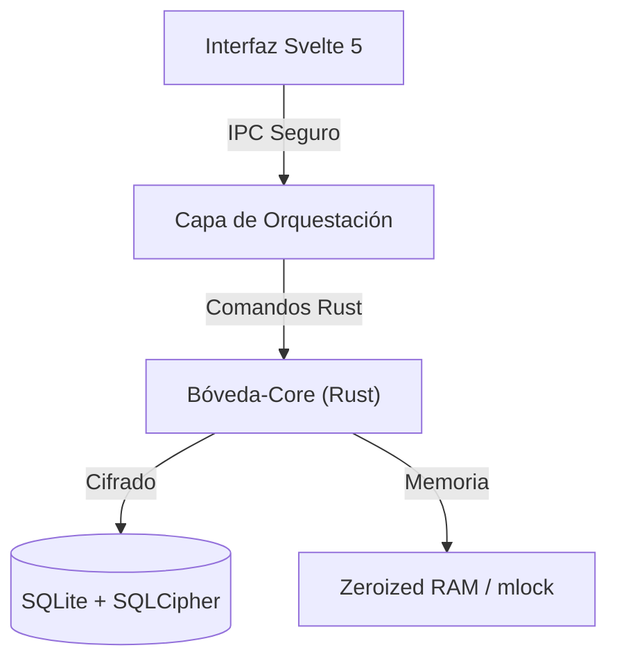

# Bóveda — Password Manager 🔒

Construida bajo la filosofía de **Seguridad por Aislamiento**. Mientras que otros de la industria priorizan la comodidad de la nube y la recolección de metadatos, Bóveda nace como una alternativa moderna para la soberanía digital total, donde tus secretos nunca tocan el disco sin cifrar ni la red sin tu permiso explícito.


---

## 🏛️ La Filosofía: Seguridad por Aislamiento

A diferencia de las soluciones convencionales, Bóveda se rige por tres pilares fundamentales que nos diferencian:

1.  **Aislamiento de Procesos:** La interfaz de usuario vive en un entorno restringido. Nunca tiene acceso directo a las claves maestras o a la base de datos. Toda operación sensible ocurre en el "Core" de Rust a través de un puente IPC (Inter-Process Communication) estrictamente tipado y auditado.
2.  **Soberanía del Dato:** No hay "nube por defecto". Tus datos te pertenecen y residen exclusivamente en tu hardware. El aislamiento no es solo técnico, es estructural: Bóveda asume que cualquier conexión externa es un vector de ataque potencial.
3.  **Resistencia Forense:** No basta con cifrar. Bóveda implementa medidas para que, incluso si un atacante obtiene acceso físico a la memoria RAM o a los volcados de sistema, no encuentre rastros legibles de tu información.

---

## 🛡️ Ingeniería de Seguridad (Bóveda Core)

El motor `boveda-core` es una pieza independiente encargada de proteger los datos sensibles:

### 🔐 Criptografía de Vanguardia
-   **Almacenamiento Ciego:** Base de datos **SQLite + SQLCipher** con cifrado **AES-256-CBC**. Protegemos no solo las entradas, sino el esquema, los índices y los metadatos.
-   **Secretos:** Cada entrada individual se cifra adicionalmente con **ChaCha20-Poly1305**, proporcionando Cifrado Autenticado con Datos Asociados (AEAD).
-   **Barrera de Fuerza Bruta:** Implementamos **Argon2id** (Parámetros: 64MB RAM, 3 iteraciones, 4 hilos), el estándar de Password Hashing Competition, configurado para ser costoso en hardware especializado (ASIC/GPU).

### 🧠 Gestión de Memoria "Inmune"
-   **Zeroización:** Uso de `Zeroize` que sobrescriben físicamente la memoria RAM con ceros en cuanto un secreto deja de ser necesario, mitigando ataques de reutilización de memoria.
-   **RAM Inamovible:** Implementamos `mlock` / `VirtualLock` para evitar que las claves maestras terminen en el archivo de intercambio (swap) del disco duro.
-   **Hardening del Proceso:** Desactivamos los `core dumps` y protegemos contra la inspección de procesos mediante políticas de seguridad a nivel de sistema operativo.

---

## 🏗️ Arquitectura de Capas



-   **`crates/boveda-core`**: El núcleo de Bóveda, sin dependencias de UI, enfocado 100% en seguridad.
-   **`src-tauri`**: Gestiona los permisos y la comunicación entre la webview y el sistema.
-   **`src`**: Nuestra interfáz de usuario, rápida y minimalista que hace que la seguridad extrema se sienta natural.
---

## 🛠️ Configuración de Desarrollo

**Requisitos:**
- [Node.js](https://nodejs.org/) (v20+)
- [pnpm](https://pnpm.io/) (v9+)
- [Rust](https://rustup.rs/) (v1.77+)
- [Tauri Prerequisites](https://tauri.app/start/prerequisites/)

```bash
# Instalar dependencias
pnpm install

# Ejecutar en modo desarrollo
pnpm tauri dev

# Compilar binario de producción
pnpm tauri build
```

## 🛡️ Auditoría y Calidad

Mantenemos un estándar de "Cero Advertencias". Puedes verificar la integridad del proyecto con:

```bash
# Auditoría completa (Rust + JS)
pnpm security
```

O por separado:
- `cargo audit`: Verifica vulnerabilidades en dependencias de Rust.
- `cargo clippy`: Linter estricto para asegurar código idiomático y seguro.
- `pnpm audit`: Verifica el ecosistema de Node.js.

---

## 🤝 Contribuciones

Si compartes nuestra visión de una privacidad sin compromisos, tus PRs son bienvenidos. Por favor, lee nuestra [Guía de Contribución](./CONTRIBUTING.md) y consulta el [ROADMAP.md](./crates/boveda-core/docs/ROADMAP.md) para ver en qué estamos trabajando.

## 📜 Licencia

Bóveda es software libre bajo la licencia **Apache-2.0**. Tu seguridad no debería ser una caja negra.
