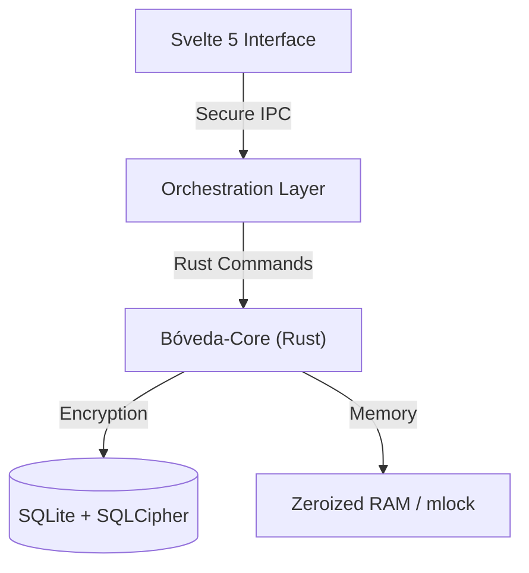

[Leer en español 🇪🇸](./README.es.md)

# Bóveda — Credential Manager


Bóveda means **Security through Isolation**. We prioritize network-isolated security and practice digital transparency.


---

## Architecture Overview

1. **Process Isolation:** Interface and motor decoupled, with regular audits.
2. **Digital Sovereignty:** There is no "cloud by default." Your data belongs to you, resides exclusively on your system, and you are solely responsible for it.
3. **Forensic Resistance:** Measures are implemented so that even if an attacker gains physical access to RAM or system dumps, they will find no readable traces of your information.

---

## Bóveda-Core

The `boveda-core` engine is responsible for protecting sensitive data:

### Cryptography
- **Storage:** **SQLite + SQLCipher** database with **AES-256-CBC** encryption. We protect not only the entries but also the schema, indexes, and metadata.
- **Secrets:** Each individual entry is additionally encrypted using **ChaCha20-Poly1305**, providing Authenticated Encryption with Associated Data (AEAD).
- **Brute-Force Protection:** We implement **Argon2id** (Parameters: 64MB RAM, 3 iterations, 4 threads), the Password Hashing Competition standard, configured to be costly on specialized hardware (ASIC/GPU).

### Memory Management
- **Zeroization:** RAM is physically overwritten with zeros as soon as a secret is no longer needed, mitigating memory reuse attacks.
- **Non-Swappable RAM:** We implement `mlock` / `VirtualLock` to prevent master keys from ending up in the operating system's swap file on the hard drive.
- **Process Hardening:** Core dumps are disabled, and process inspection is blocked using OS-level security policies.

---

## Layered Architecture



- **`crates/boveda-core`**: The core of Bóveda.
- **`src-tauri`**: Manages permissions and communication between the webview and the system.
- **`src`**: our user interface.
---

## Development Setup

**Prerequisites:**
- [Node.js](https://nodejs.org/) (v20+)
- [pnpm](https://pnpm.io/) (v9+)
- [Rust](https://rustup.rs/) (v1.77+)
- [Tauri Prerequisites](https://tauri.app/start/prerequisites/)

```bash
# Install dependencies
pnpm install

# Run in development mode
pnpm tauri dev

# Build production binary
pnpm tauri build
```

## Audit and Quality

```bash
# Full security audit (Rust + JS)
pnpm security
```

Or individually:
- `cargo audit`: Checks for vulnerabilities in Rust dependencies.
- `cargo clippy`: Strict linter to ensure idiomatic and secure code.
- `pnpm audit`: Checks the Node.js ecosystem.

---

## 🤝 Contributing

If you share our vision of uncompromised privacy, your PRs are welcome. Please read our [Contributing Guide](./CONTRIBUTING.md) and review the [ROADMAP.md](./crates/boveda-core/docs/ROADMAP.md) to see what we are working on.

## License

Bóveda is free software under the **GPL-3.0** license.

## Project Documents


| Document | Description |
| :--- | :--- |
| [CONTRIBUTING.md](./CONTRIBUTING.md) | Guide for contributors |
| [CODE_OF_CONDUCT.md](./CODE_OF_CONDUCT.md) | Community code of conduct |
| [CODE_SIGNING_POLICY.md](./CODE_SIGNING_POLICY.md) | Code signing policy |
| [SECURITY.md](./SECURITY.md) | Security policy and vulnerability reporting |
| [PRIVACY.md](./PRIVACY.md) | Privacy policy |
| [CHANGELOG.md](./CHANGELOG.md) | Change log |

## Acknowledgements

* Free code signing provided by [SignPath Foundation](https://signpath.org).


