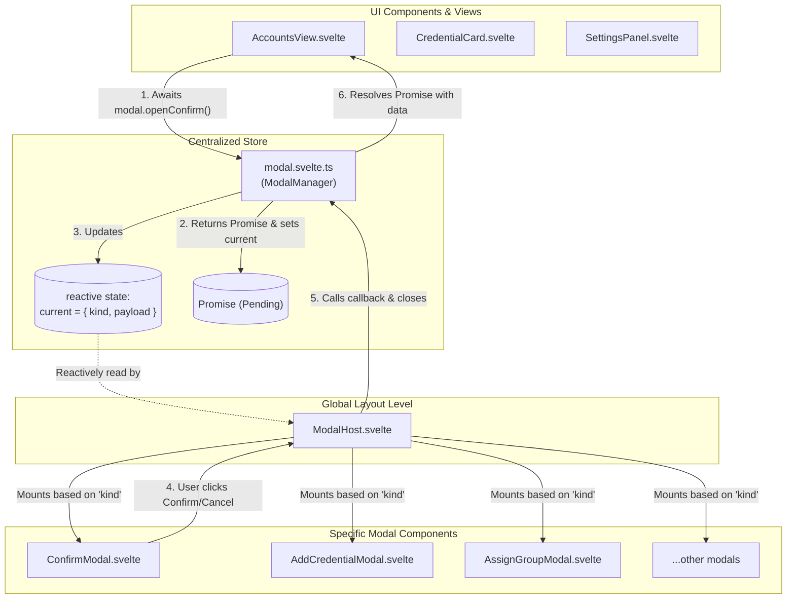

# Bóveda Modal Architecture

This design pattern ensures that modals can be triggered from anywhere in the application (even outside of UI components, like from utility functions) without needing to clutter individual component templates with `<Modal />` markup.

## Visual Diagram

The following Mermaid diagram illustrates how the different layers interact:



---

## Core Components

### 1. The Modal Manager (`src/lib/stores/modal.svelte.ts`)
This is the brain of the modal system. It exports a singleton `modal` object.
- **State**: Holds the `current` active modal state (`$state`), storing the `kind` of modal and its `payload`.
- **Actions**: Provides typed methods like `openConfirm(payload)` or `openAddCredential(payload)` which return a **`Promise`** instead of requiring callbacks. Inside each method, a new `Promise` wrapper is created, mapping resolution handlers (`resolve(true/false)` or data) to internal `onconfirm`/`oncancel`/`onadded` callbacks.

### 2. The Modal Host (`src/lib/components/modals/ModalHost.svelte`)
This component is mounted **only once**, usually in your root `+layout.svelte`.
- It continuously listens to `modal.current`.
- When a modal is active, it mounts the correct Svelte component and wires the internal callbacks.
- It acts as an interceptor: when the modal component fires `onconfirm` or `oncancel`, the `ModalHost` intercepts it, calls `modal.close()`, and fires the promise resolution callback, fulfilling the `await` statement at the caller side.

### 3. Specific Modals (`src/lib/components/modals/...`)
These are the actual UI components containing the layout, text, and buttons. 
- Example: `ConfirmModal.svelte` or `AddCredentialModal.svelte`.
- They receive data via `$props()` (passed down by `ModalHost`).
- They emit actions (like `onconfirm` or `onclose`) back up to `ModalHost`.

### 4. The Callers (e.g., `src/lib/components/views/AccountsView.svelte`)
Any component or function that needs to show a modal simply imports the `modal` store and awaits the returned promise.
```typescript
import { modal } from '$lib/stores/modal.svelte';

const confirmed = await modal.openConfirm({
  title: "Eliminar Credencial",
  message: "¿Estás seguro?",
  type: "danger"
});

if (confirmed) {
  // Delete logic here (runs only if user clicked confirm)
}
```

---

## How to Edit or Add a New Modal

If you are a contributor and need to modify or create a modal, follow these steps:

### Editing an Existing Modal
1. Find the modal UI component in `src/lib/components/modals/` (e.g., `confirmation/ConfirmModal.svelte` or `forms/AddCredentialModal.svelte`).
2. Modify the HTML/Svelte code as needed.

### Adding a Completely New Modal
1. **Create the UI Component**: Create your new `MyNewModal.svelte` in `src/lib/components/modals/`.
2. **Define the Types**: Go to `src/lib/stores/modal.svelte.ts`.
   - Add a new payload interface specifying callback signatures (e.g., `export interface MyNewPayload { id: string; onsuccess?: () => void; oncancel?: () => void; }`).
   - Add it to the `ModalDescriptor` union type (`| { kind: 'my-new-modal', payload: MyNewPayload }`).
3. **Add the Store Method**: Inside the `ModalManager` class in `modal.svelte.ts`, add the Promise-returning wrapper:
   ```typescript
   openMyNewModal(payload: Omit<MyNewPayload, 'onsuccess' | 'oncancel'>): Promise<boolean> {
     return new Promise((resolve) => {
       this.current = {
         kind: 'my-new-modal',
         payload: {
           ...payload,
           onsuccess: () => resolve(true),
           oncancel: () => resolve(false)
         }
       };
     });
   }
   ```
4. **Register in ModalHost**: Go to `src/lib/components/modals/ModalHost.svelte`.
   - Import your new component.
   - Add a new `{:else if modal.current?.kind === 'my-new-modal'}` block.
   - Wire up the props and callbacks. Ensure that both successful and cancellation actions resolve the pending promise by invoking their respective captured callbacks from the payload.
5. **Call it with async/await!**:
   ```typescript
   const success = await modal.openMyNewModal({ id: "123" });
   if (success) {
     // Run success logic
   }
   ```
